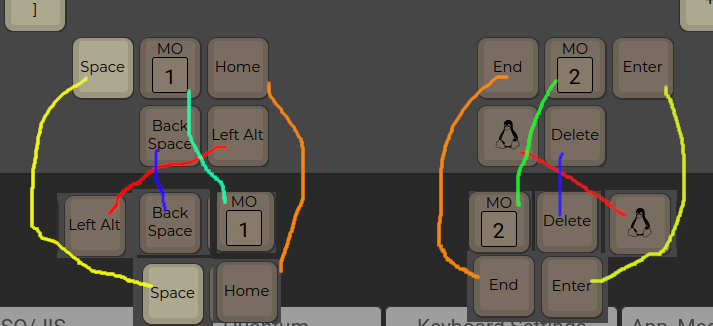
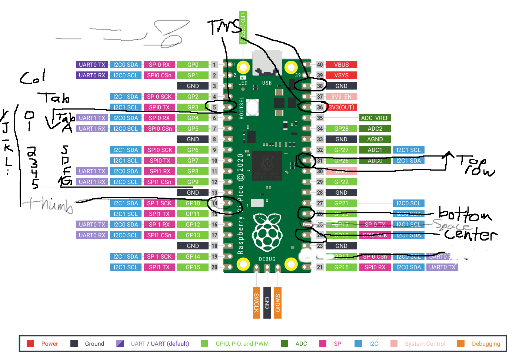

# Dactyl-Manuform Keyboard
Handwired dactyl-manuform keyboard with Raspberry Pi Pico RP2040s

tl/dr: 3d print case, get some switches and connect rows together, columns together, wire to a circuitboard and load a keyboard layout onto it

I used the base handwired/dactyl_manuform_4x6_5 on config.qmk.fm and modified the layout.

## to create/change the keyboard layout
- make your layout on config.qmk.fm
- download the json file
- open terminal in downloads folder and run:
  
  ``qmk compile [filename].json -e CONVERT_TO=kb2040
``
- this creates a new uf2 file in your qmk folder
- click the reset button on the RP2040 or hit the reset keys if you already have firmware loaded
- drag and drop the new uf2 file onto the RP2040
  
idk why but just using the cli flash method never worked for me, had to create the UF2 and drag and drop onto the pico

you only need to flash once for the whole board, you dont need to flash each piece individually.

After soldering all the thumb keys I discovered they don't match the order on config.qmk.fm so I handle the error by adjusting the layout like so: 

## wiring
I did 3 rows and 6 columns with a 5 key thumb cluster. I got tripped up because I assumed the coding would be for 4 rows x 6 cols but it defaults to use an additional row. So the center column of the thumb cluster is actually two separate rows of the same column (lower switch goes to pin labled "space" in the pinout diagram, all others go to 'thumb' pin GP10).

## pin map

connect 3v3 to 3v3, ground to ground and SPIO/GP3 to SPIO/GP3, this works with a TRS (male to male audio) cable
